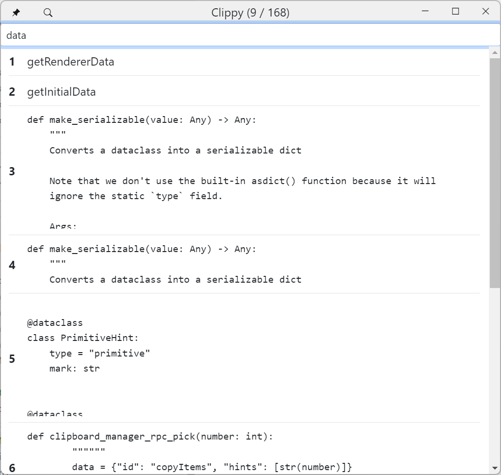

# Clippy

Clipboard manager with RPC and Talon support. Supports copying and pasting multiple things at once.

## Installation

1. Copy this folder to your Talon user directory
2. Install the Clippy application
    - https://github.com/AndreasArvidsson/clippy

## Examples

`"clippy"` to open Clippy UI

-   `"clippy copy air"`
-   `"clippy paste air"`
-   `"clippy chuck air"`

### Multiple targets

-   `"clippy copy air and bat"`
-   `"clippy copy air past bat"`
-   `"clippy copy 2 items air"`

For more commands look in the `.talon` files.

## Images

