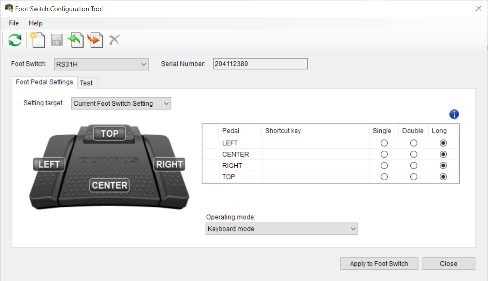

# Foot switch integration

## Hardware

[Olympus RS31H](https://www.amazon.com/Olympus-RS31H-Professional-Dictation-Connection/dp/B01C3FSPQK)

## Installation

1. Download [Foot Switch Configuration Tool](https://dl-support.olympus-imaging.com/odms_download/ftsw_configuration_tool/en/)
1. Open foot switch configuration tool
1. Change operating mode to: `Keyboard mode`
    - The above step can be achieved by importing [olympus_rs31h.xml](./olympus_rs31h.xml)
1. Change shortcut keys to: F13, F14, F15, F16
    - The above step can be achieved by importing [olympus_rs31h.xml](./olympus_rs31h.xml)
    - On Windows F-keys above F12 won't be visible in the tool, but works if imported
      
1. Add [foot_switch.talon](./foot_switch.talon) and [foot_switch.py](./foot_switch.py) to your Talon user directory
1. My mouse scroll actions are not Knausj default. To utilize my implementation of mouse scroll with the foot switch you will need [mouse_scroll.py](../mouse/mouse_scroll.py)
