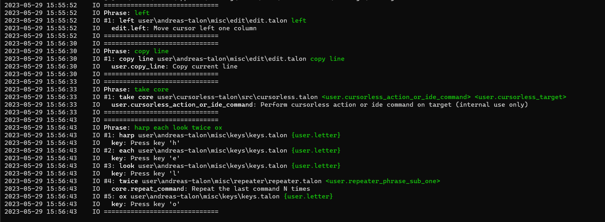

# Analyze phrase

Analyzes a spoke in Talon phrase returning metadata and description for actions.

## Pretty print phrase

One of the use cases for analyzing phrases is to provide description of commands within the phrase.



## Usage

```py
from talon import speech_system, actions

def on_post_phrase(phrase):
    # Get an analyzed phrase
    analyzed_phrase = actions.user.analyze_phrase(phrase)

    # Pretty print analyzed phrase
    actions.user.pretty_print_phrase(analyzed_phrase)

speech_system.register("post:phrase", on_post_phrase)
```

## Format

```js
AnalyzedPhraseWithActions({
    phrase: "test air batt five",
    words: [
        AnalyzedWord({
            text: "test",
            start: 7821.851141466672,
            end: 7822.0911414666725,
        }),
        AnalyzedWord({
            text: "air",
            start: 7822.144474800006,
            end: 7822.277808133339,
        }),
        AnalyzedWord({
            text: "batt",
            start: 7822.304474800006,
            end: 7822.544474800005,
        }),
        AnalyzedWord({
            text: "five",
            start: 7822.571141466672,
            end: 7822.997808133339,
        }),
    ],
    metadata: {
        audio_ms: 1590.0,
        compile_ms: 0.011499999345687684,
        pad_ms: 2.5589999995645485,
        emit_ms: 40.27730000052543,
        decode_ms: 12.326699999903212,
        total_ms: 52.61549999977433,
        clock_ms: 55.049896240234375,
        engine: "wav2letter",
        model: "conformer",
        desc: "W2lEngine(fast Conformer b108 (2021-09-15))",
    },
    commands: [
        AnalyzedCommandWithActions({
            phrase: "test air batt five",
            rule: "test [<user.letter>] <user.letter> <number_small>",
            code: 'print("{letter_1} {letter_2} {number_small}")\n',
            path: "user\\andreas-talon\\misc\\editor.talon",
            line: 84,
            captures: [
                AnalyzedCapture({ phrase: "test", value: "test", name: None }),
                AnalyzedCapture({
                    phrase: "air",
                    value: "a",
                    name: "user.letter",
                }),
                AnalyzedCapture({
                    phrase: "batt",
                    value: "b",
                    name: "user.letter",
                }),
                AnalyzedCapture({
                    phrase: "five",
                    value: 5,
                    name: "number_small",
                }),
            ],
            captureMapping: { letter: ["a", "b"], number_small: [5] },
            actions: [
                AnalyzedAction({
                    code: 'print("{letter_1} {letter_2} {number_small}")',
                    name: "print",
                    params: '"{letter_1} {letter_2} {number_small}"',
                    path: "talon\\scripting\\core\\main.py",
                    line: None,
                    modDesc: "Display an object in the log",
                    ctxDesc: "Display an object in the log",
                    explanation: "Log text 'a b 5'",
                }),
            ],
        }),
    ],
});
```
