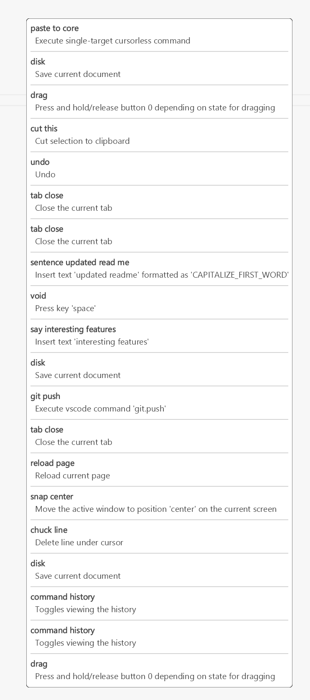

# Command history

Command history with description of performed commands and their actions



## Usage

Dependent on [Analyze phrase](../analyze_phrase)

```py
from talon import speech_system, actions

def on_post_phrase(phrase):
    # Get an analyzed phrase
    analyzed_phrase = analyzed_phrase(phrase)

    # Append analyzed phrase to command history
    command_history_append(analyzed_phrase)

speech_system.register("post:phrase", on_post_phrase)
```

## Demo

[YouTube - Command history demo](https://youtu.be/Qv0bhLw68pU)
