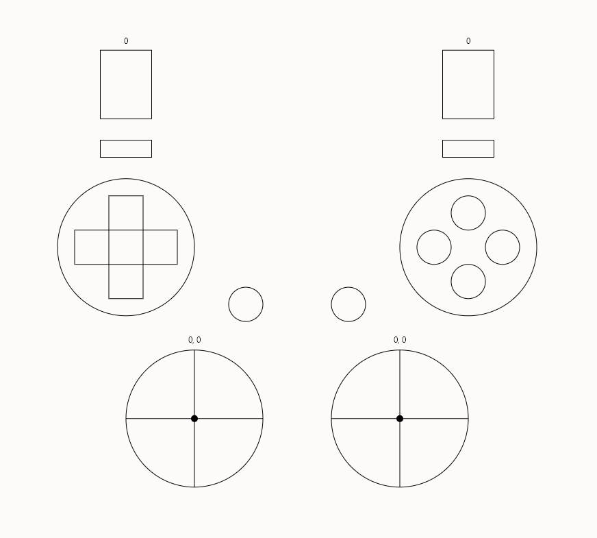

# Gamepad tester

## Usage
1. Say `"gamepad tester"` to open gamepad tester UI. 
1. Press buttons on actual gamepad and see interaction in UI.
1. Close gamepad tester by saying `"gamepad tester"` again.