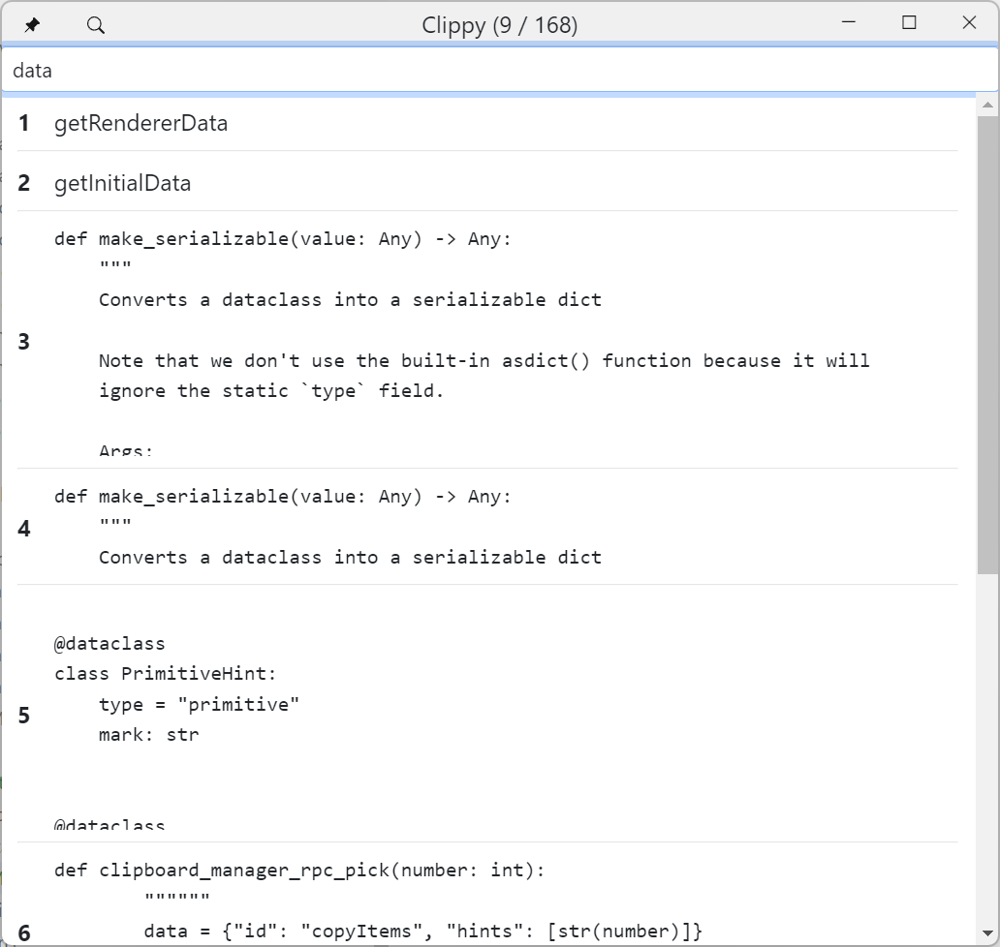

# Clippy

Clipboard manager with RPC and Talon support. Supports copying and pasting multiple things at once.

## Examples

`"clippy"` to open Clippy UI

-   `"clippy copy air"`
-   `"clippy paste air"`
-   `"clippy chuck air"`

### Multiple targets

-   `"clippy copy air and bat"`
-   `"clippy copy air past bat"`
-   `"clippy copy 2 items air"`

## Images

